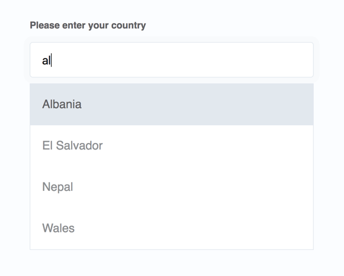

## Tuts+ - [JavaScript For Web Designers / Textbox Auto Complete](https://webdesign.tutsplus.com/courses/javascript-for-web-designers)

In this tutorial, we learn how to use JavaScript to code an auto complete textbox that list a list of countries that match the inputs keyed in.

[View your demo site here.](https://github.com/WebDevTuts/textbox_autocomplete)

